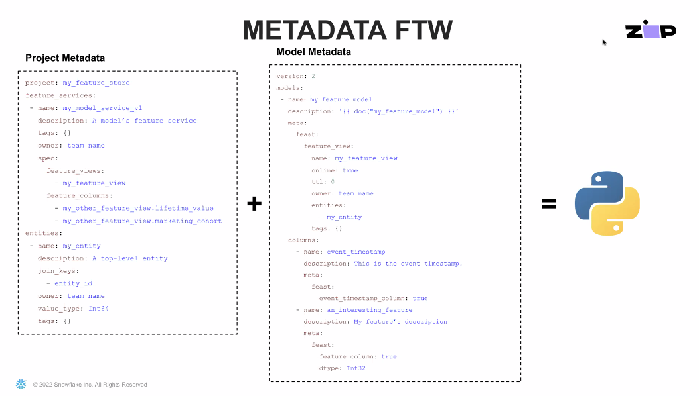

# Cloud Computing Careers and Certifications

**#Role**

* IT Pro  -> Network professional / Help desk -> DevOps/Security
* Developer -> Application / Database Developer
* Analyst -> Business Analyst / Data Scientist -> ML Developer
* <mark style="color:yellow;">**Architect**</mark> -> Solution Architect / System Architect

&#x20;**#ITProSkills**

* Operation
  *   Visualization -> cloud VM / load balance / container(docker) /&#x20;

      &#x20;                          <mark style="color:yellow;">container orchestration (kubernetes) 容器编排</mark>&#x20;
  * Networking -> VPN/ subnet/ IPv4 IPv6
*   Management

    *   Security -> firewall rules / <mark style="color:yellow;">user, group, service authentication & authorization(IAM)</mark>

        &#x20;                   security auditing & compliance
    * Monitoring -> performance alter setup, monitoring & response

    &#x20;                             observability, log maintenance / service-level agreements

    *   Scaling -> scaling up, down / cost predictability & management /&#x20;

        &#x20;                 sizing service instances correctly
*   Automation<mark style="color:yellow;">(deployment CI/CD)</mark>

    * Scripting -> cloud environment / disaster recovery drills, time-to-recover tests

    &#x20;                          selection and use of thrid-party cloud tools(use ide)

&#x20;**#DeveloperSkills**

* Programming
  * Application and API development
* Databases
  * <mark style="color:yellow;">RDB programming</mark>
  * NoSQL programming(Redis, MongoDB, Neo4j)
  * Spark(Hadoop) data pipeline programming
  * data lake management
* Machine learning(data science) app development
  * predictive analytics
  * deep neural network(<mark style="color:yellow;">tensorflow</mark>)
  * data pipeline programming
  * data lake management
* Mobile and IoT app development
* Languages&#x20;

| Task                                        | Application                                               | Configuration     |
| ------------------------------------------- | --------------------------------------------------------- | ----------------- |
| <mark style="color:yellow;">Majority</mark> | <mark style="color:yellow;">Python</mark>, JavaScript, Go | Python            |
| Data Programming                            | <mark style="color:yellow;">SQL and SQL extensions</mark> | Bash - vendor CLI |
| Analytic Programming                        | Python, R, and Scale                                      | Terraform         |

* Tools and IDES
  * Vender cloud SDK
  * Vender cloud CLI and tools
  * Smart editor with add-ins(VScode) or <mark style="color:yellow;">online</mark>

&#x20;**#Certifications**

****[https://www.skillsoft.com/blog/15-top-paying-it-certifications-of-2022](https://www.skillsoft.com/blog/15-top-paying-it-certifications-of-2022)

AWS -> Azure -> Google -> Alibaba -> IBM ****&#x20;

[https://github.com/lynnlangit/learning-cloud/](https://github.com/lynnlangit/learning-cloud/)

* AWS: Foundational -> Association -> Professional <mark style="color:yellow;">**exam guide / practice exam**</mark>
  * <mark style="color:yellow;">**Cloud Practitioner**</mark> - Foundational
  * Architect
  * Developer
  * Operations
  * Specialty - security...
* Azure -> role-based
  * Fundamentals -> <mark style="color:yellow;">**Azure**</mark>/AI/<mark style="color:yellow;">Data</mark>
  * Associate&#x20;
  * Expert
  * Specialty

<figure><figcaption>
<a href="https://files.gitbook.com/v0/b/gitbook-x-prod.appspot.com/o/spaces%2FX45XM2JZMO3a8qkbpzrx%2Fuploads%2Flxo1fEKKILaFCKSRqlVd%2FAzure%20Certs%20Poster.pdf?alt=media&#x26;token=29b44255-585f-404b-a5db-d14493fef7bd">https://files.gitbook.com/v0/b/gitbook-x-prod.appspot.com/o/spaces%2FX45XM2JZMO3a8qkbpzrx%2Fuploads%2Flxo1fEKKILaFCKSRqlVd%2FAzure%20Certs%20Poster.pdf?alt=media&#x26;token=29b44255-585f-404b-a5db-d14493fef7bd</a>
</figcaption></figure>

* GCP
  * Foundation  -> <mark style="color:yellow;">**Cloud Digital Leader**</mark>
  * Associate -> Cloud Engineer
  * Professional -> role-based
* Other
  * Data visualization -> Tableau / looker(GCP)
  * <mark style="color:yellow;">**Data lakehouses -> Databricks: Apache Spark / SnowflakeDB**</mark>

**#CloudCareerPath**

****
